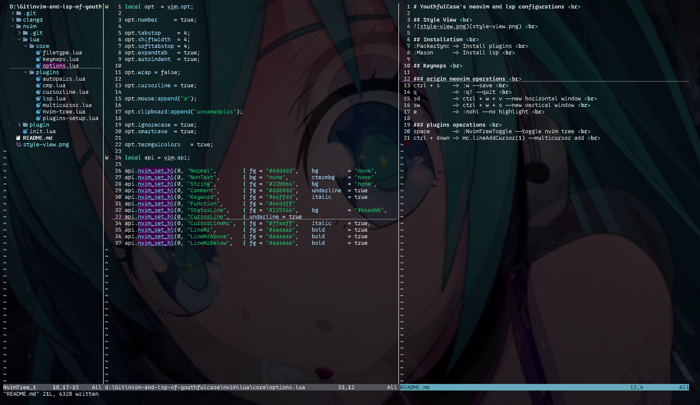

# YouthfulCase's neovim and lsp configurations  
我的neovim和lsp们的配置。  

## 展示  
  

## 安装  
:PackerSync -> 下载插件  
:Mason      -> 下载lsp  
clangd.toml中需手动修改编译器地址  

## 键位  

### 原生neovim操作  
ctrl + s    对 :w --保存  
q           对 :q! --退出  
sd          对 ctrl + w + v --新增水平窗口  
sw          对 ctrl + w + s --新增竖直窗口  
e           对 :nohl --取消高亮  

### 插件操作  
ctrl + e    对 cmp.mapping.abort() --关闭自动补全提示
space       对 :NvimTreeToggle --开关nvim tree    
ctrl + down 对 mc.lineAddCursor(1) --多加一个光标  
